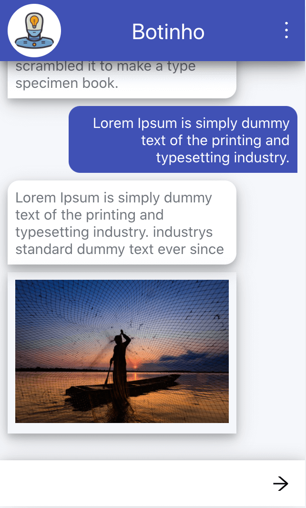

<h1 align="center" style="border-bottom: none;">💬 React  Chatbot UI</h1>

Work in progress

<h3 align="center">This React app, is a fully customizable web-based client for Chatbots.</h3>

    
    

## A solid foundation
React, Redux, Ant Design, React Router, Firebase integration. A perfect combination of best frameworks.

    
    
    
    
    

## How to use
1. Install all depencys by the command `npm install`.
1. Run the app in the development mode `npm start`.
1. Open [http://localhost:3000](http://localhost:3000) to view it full screen in the browser.
1. You can see in the file `samples/embedded-chat/index.html` how to embedded the chat into your page.

Please note this app is only the UI, you need implement the back-end app to connect to the NLU service.

## Customize
### 🤖 NLUs
In the `src/utils/` you can find the files responsibles to convert the NLU format to the format used by the app.

### 🌈Colors
In the `src/styles/theme.css` you can customize the colors of your chat.

😃 If you liked this project and used it in yout chatbot please let me know!
