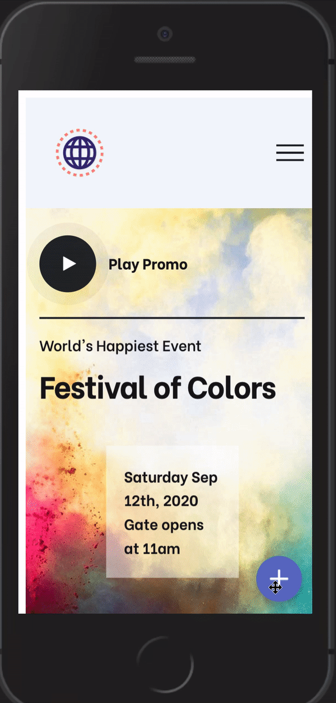

<h1 align="center" style="border-bottom: none;">💬 React  Chatbot UI</h1>
<h4 align="center">This React app, is a fully customizable web-based client for Chatbots.</h4>
<p align="center">
    
</p>

#### A solid foundation

React, Redux, Ant Design Icons. A perfect combination of best frameworks.

<p align="center">
    
    
    
</p>

#### Responsive

<p align="center">
    
</p>

#### How to use

```bash
$ git clone https://github.com/PeterPimentel/react-web-chat
$ cd react-web-chat/
$ npm install
```

1. Rename the file `.env.example` to `.env`
1. Run the app in the development mode `npm start`.
1. Open [http://localhost:3000](http://localhost:3000) to view it full screen in the browser.
1. You can see in the file `samples/embedded-chat/index.html` how to embedded the chat into your page.

<span  style="color:#660000">Please note this app is only the UI, you need implement the back-end app to connect to the NLU service.<span>

---

#### Customize

##### 🌈 Colors

In the `src/styles/colors.css` you can customize the colors of your chat.

---

😃 If you liked this project and used it in yout chatbot please let me know!
